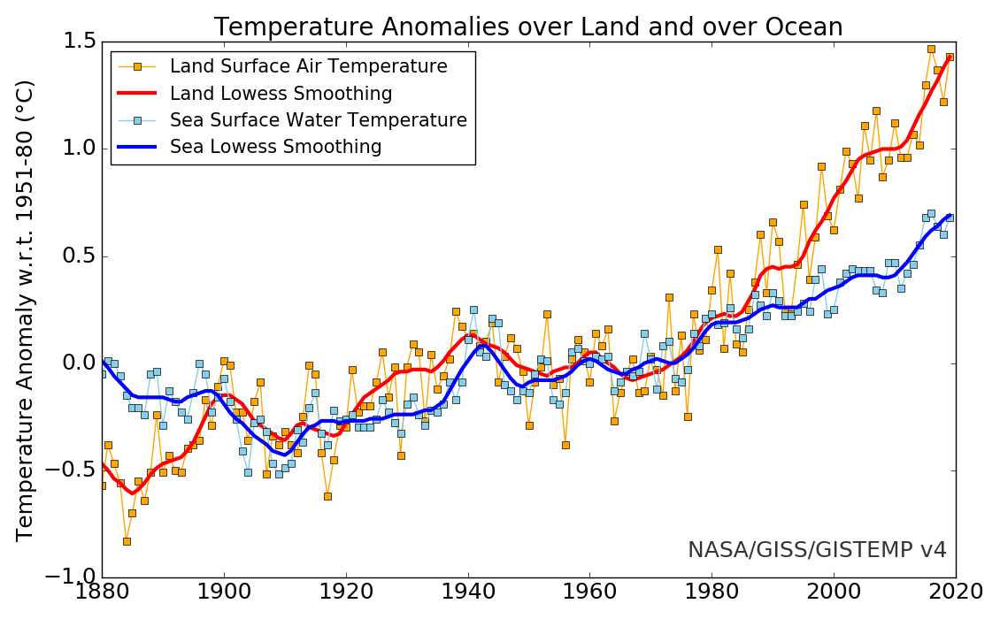
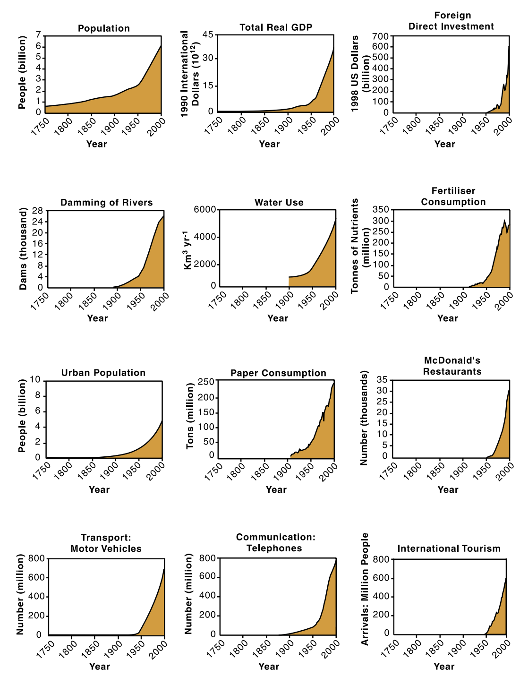
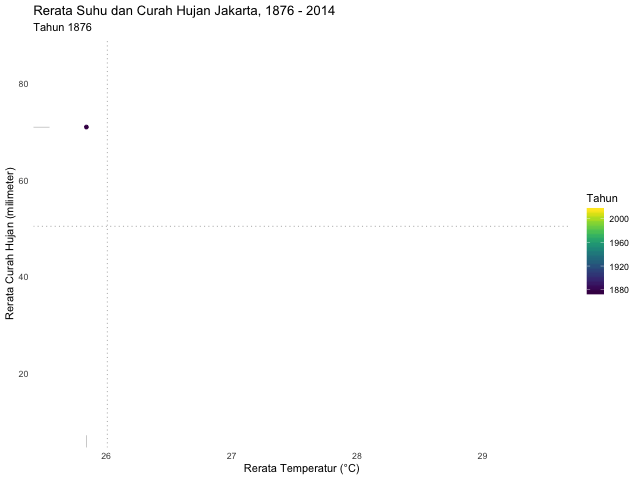

```{r setup, include=FALSE}
knitr::opts_chunk$set(echo = TRUE)
```

Halo, selamat datang di tulisan saya bulan ini (iya, saya sedang berusaha untuk menulis paling tidak sekali sebulan!). Berbeda dengan tulisan sebelumnya yang bertopik geosains (yang [ini](https://medium.com/@aviandito/k-means-clustering-pada-data-well-log-2f9c52cb3693) dan yang [itu](https://medium.com/@aviandito/well-log-data-wrangling-menggunakan-r-a4bd70206787)), kali ini saya mencoba menulis tentang topik kebumian lainnya. 

Tulisan kali ini didasari rasa penasaran saya mengenai suhu dan curah hujan Jakarta, yang akhir-akhir ini menjadi perbincangan hangat di media. Seperti yang kita ketahui, Februari 2020 ditandai dengan beberapa hari [hujan ekstrem](https://www.beritasatu.com/megapolitan/593508/curah-hujan-377-milimeterhari-tertinggi-sejak-1866) yang menyebabkan banjir besar di Jakarta. Pemanasan global akibat emisi karbon ditenggarai menjadi [penyebab cuaca menjadi semakin tidak terprediksi](https://www.nature.com/articles/d41586-018-07447-1). _Tapi apakah benar suhu dan curah hujan di Jakarta berubah seiring waktu?_

Untuk menjawab hal tersebut, saya ingin membuat animasi perubahan suhu dan curah hujan per tahun di Jakarta. Untungnya keterbukaan data cuaca di Indonesia berada seratus langkah di depan dibandingkan data lainnya. Saya menggunakan dataset [Southeast Asian Climate Assessment & Dataset (SACA&D)](http://sacad.database.bmkg.go.id/) hasil kerja keras A.M.G. Klein Tank dkk., dan merupakan kerjasama antara BMKG dan KNMI (Badan meteorologi Belanda). Dataset SACA&D berisi data pengamatan cuaca harian sejak masa kolonial yang lengkap, sangat mudah diakses, serta disajikan dalam format yang ramah komputer. Sudah selayaknya SACA&D menjadi _benchmark_ bagi inisiatif data terbuka di instansi pemerintahan lainnya! 

Untuk memvisualisasikan perubahan yang terjadi dari tahun ke tahun, saya ingin mencoba menggunakan `gganimate` yang merupakan _package_ R untuk membuat animasi `ggplot`. _Package_ `gganimate` relatif mudah digunakan dan cukup banyak petunjuknya di internet, dan saya menemukan artikel [ini](https://goodekat.github.io/presentations/2019-isugg-gganimate-spooky/slides.html#1) sangat membantu dalam proses penulisan.

Sebelum mulai, _disclaimer singkat: saya bukan ahli di bidang klimatologi, dan tujuan utama artikel ini adalah mencoba membuat animasi data iklim menggunakan `gganimate`._ Saya berusaha membaca [_guideline WMO_ mengenai penghitungan normal iklim](https://library.wmo.int/doc_num.php?explnum_id=4166), tapi namanya manusia pasti ada salahnya kan ya. Jadi, mohon kritik dan sarannya di kolom komentar, terutama koreksi apabila saya melakukan kesalahan dalam menyarikan dan menyajikan data :)

Tanpa berlama-lama, mari kita mulai! Berikut _package_ yang saya gunakan dalam tulisan ini. 

```{r, message=FALSE, warning=FALSE}
library(tidyverse)
library(lubridate)
library(gganimate)
library(viridis)
library(ggrepel)

# I particularly like theme_minimal's simplicity. This will make subsequent plots uses this theme
theme_set(theme_minimal())
clean_grid <- theme(panel.grid.major = element_blank(), panel.grid.minor = element_blank())
```

## Memuat dan Merapikan Data

Dataset SACA&D menyimpan data klimatologi tiap-tiap stasiun di seluruh negara anggota dengan _granularity_ harian. Ada beberapa stasiun pengamatan di wilayah Jakarta, tetapi saya memilih untuk mengunduh pembacaan dari Stasiun Meteorologi Kemayoran. Untuk data yang lebih lengkap, saya mengunduh data _blended_: apabila tersedia, pembacaan dari stasiun lain di wilayah Jakarta digunakan untuk melengkapi kekosongan data Stasiun Meteorologi Kemayoran. dapat dibaca [di sini](http://sacad.database.bmkg.go.id/helptext/blending_help.html).

### Data suhu harian rata-rata

Data suhu harian rata-rata (_blended_) dari Stasiun Meteorologi Kemayoran tersedia sejak 1 Januari 1866. Sejak tanggal tersebut, terdapat 48.887 pembacaan temperatur harian. Pengamatan ini pastinya tidak lengkap (ketidaklengkapan data banyak terjadi di masa revolusi kemerdekaan, Agresi Militer/Aksi Polisionil, dan lain-lain) tetapi ketersediaan data sebanyak itu secara digital dan mudah diakses patut diapresiasi!

```{r}
temp <- read_csv(file = 'TG_STAID000180.TXT', skip = 18) %>%
  filter(Q_TG == 0) %>%
  mutate(DATE = parse_date(as.character(DATE), format = "%Y%m%d"),
         TG = TG * 0.1) %>%
  select(-c(SOUID, Q_TG))

glimpse(temp)
```

### Data curah hujan harian

Sama seperti data suhu rata-rata harian, data curah hujan harian (_blended_) dari Stasiun Meteorologi Kemayoran juga tersedia sejak 1 Januari 1866. Terdapat 50.516 pengamatan curah hujan harian sejak tanggal tersebut.

```{r}
precip <- read_csv(file = 'RR_STAID000180.TXT', skip = 18) %>%
  filter(Q_RR == 0) %>%
  mutate(DATE = parse_date(as.character(DATE), format = "%Y%m%d")) %>%
  select(-c(SOUID, Q_RR))

glimpse(precip)
```

### Menggabungkan data curah hujan dan temperatur

Untuk analisis ini, saya melakukan `join` agar kita bisa memiliki _dataframe_ berisi pembacaan suhu dan curah hujan harian. Lebih tepatnya, saya melakukan `inner_join` untuk menyisakan hari-hari yang memiliki pembacaan curah hujan (`RR`) dan suhu rata-rata (`TG`) yang lengkap saja. Proses ini menghasilkan _dataframe_ `klima`, yang berisi 48.409 hari pengamatan. Saya juga menambahkan kolom-kolom tahun, bulan, dan hari ke dalam `klima` untuk memudahkan proses penyiapan data.

```{r}
klima <- precip %>%
  inner_join(temp) %>% # inner join because I want to include only days with complete precip & temp info
  mutate(month_year = floor_date(DATE, unit = 'month'), # extract date and month from date for summarising
         year = year(DATE), 
         month = month(ymd(DATE)),
         day = day(DATE)) %>%
  select(DATE, month_year, year, month, day, RR, TG) # just so the columns are nicely organised

glimpse(klima)
```

## Menyiapkan Data Sesuai Standar

Berdasarkan [_guideline WMO_ mengenai penghitungan data iklim,](https://library.wmo.int/doc_num.php?explnum_id=4166) rupanya ada beberapa hal yang harus diperhatikan mengenai kelengkapan data dalam penghitungan selama periode tertentu.

Untuk data rata-rata (_mean_) bulanan, standar WMO menyebutkan bahwa dalam periode observasi bulanan, *maksimal terdapat 11 hari yang hilang*. Selain itu, terdapat "autokorelasi" pada data cuaca, atau pengamatan dalam hari-hari yang berdekatan saling berhubungan satu sama lain. Misalnya, apabila suhu rata-rata hari ini adalah 25°C, kecil kemungkinan bahwa suhu rata-rata besok atau kemarin adalah 0°C. Oleh karena itu, *tidak boleh ada 5 pengamatan yang hilang secara berurutan*.

Sedangkan untuk data penjumlahan (_summation_), *data hari dalam suatu bulan pengamatan harus lengkap*. Sehingga, untuk melihat jumlah curah hujan bulanan, saya harus membuang bulan-bulan yang harinya tidak lengkap dari perhitungan.

Untuk menyiapkan data supaya sesuai standar, hal yang saya lakukan adalah membuat daftar bulan-bulan yang tidak lengkap berdasarkan syarat-syarat di atas, kemudian lakukan `anti_join` antara _dataframe_ `klima` dengan daftar tersebut.

### Mengecek kelengkapan hari

Untuk memenuhi syarat pertama (maksimal 11 hari hilang dalam suatu bulan), saya menggunakan fungsi `lubridate::days_in_month()` untuk mencari jumlah hari dalam tiap bulan, kemudian menghitung jumlah pengamatan di setiap bulannya. Apabila perbedaan di antara keduanya lebih dari 11 hari, maka saya tandai (_flag_) bulan tersebut. Daftar bulan-bulan yang memiliki lebih dari 11 hari hilang saya kumpulkan dalam _dataframe_ `incomplete_n`.

```{r}
# missing days
incomplete_n <- klima %>%
  group_by(month_year) %>%
  # count available data grouped by month
  count() %>% 
  ungroup() %>%
  # get number of days for each month
  mutate(day_cnt = days_in_month(month_year), 
         # establish threshold as per WMO standard (max. 11 missing days)
         threshold = days_in_month(month_year) - 11, 
         # for each month, if data is less than missing data threshold, flag as 1 
         is_incomplete_n = ifelse(n < days_in_month(month_year) - 11, 1, 0)) %>% 
  filter(is_incomplete_n == 1)

head(incomplete_n)
```

Untuk melihat hari yang hilang secara berurutan, pertama-tama saya mengurutkan data sesuai hari, kemudian saya menggunakan `lead()` untuk membaca hari di baris selanjutnya (_"lead day"_). Apabila perbedaan antara hari tersebut dan _lead_-nya lebih dari 5, maka berarti bulan tersebut memiliki paling tidak 5 hari yang hilang secara berurutan, yang kemudian saya berikan _flag_. Daftar bulan yang memiliki 5 hari hilang secara berurutan saya kumpulkan dalam _dataframe_ `incomplete_consec`.

```{r}
# consecutive missing days
incomplete_consec <- klima %>%
  arrange(DATE) %>%
  select(DATE, month_year, day) %>%
  # check for next date for each day
  mutate(lead = lead(day), 
         # for each day, if the next date is more than consecutive missing data threshold, flag as 1
         is_incomplete_consec = ifelse(lead - day > 5, 1, 0)) %>% 
  filter(is_incomplete_consec == 1)

head(incomplete_consec)
```

Terakhir, untuk mencari bulan-bulan yang harinya tidak lengkap, saya kembali menggunakan fungsi `lubridate::days_in_month()` dan hitungan hari di tiap bulan. Apabila jumlah keduanya tidak sama, berarti pengamatan di bulan itu tidak lengkap. Saya menandai bulan-bulan tidak lengkap tersebut, dan menyimpannya di _dataframe_ `incomplete_day`.

```{r}
incomplete_day <- klima %>%
  group_by(month_year) %>%
  # count available data grouped by month
  count() %>% 
  ungroup() %>%
  # get number of days for each month
  mutate(day_cnt = days_in_month(month_year),
         # for each month, if data is less than number of day, flag as 1 
         is_incomplete_day = ifelse(n < days_in_month(month_year), 1, 0)) %>% 
  filter(is_incomplete_day == 1)

head(incomplete_day)
```

Tahapan-tahapan di atas menghasilkan tiga _dataframe_ (`incomplete_n`, `incomplete_consec`, dan `incomplete_day`) yang berisi daftar bulan yang tidak memenuhi syarat dalam _guideline_ WMO. Sekarang saatnya melakukan `anti_join` antara _dataframe_ utama (`klima`) dengan ketiga _dataframe_ tersebut sesuai kebutuhan.

### Membuat _dataframe_ untuk visualisasi

Untuk melakukan penghitungan _mean_, diperlukan dataset dengan bulan yang paling banyak memiliki 11 pengamatan hilang _dan_ tidak ada pengamatan yang hilang selama 5 hari berturut-turut. Untuk itu, saya melakukan `anti_join` antara `klima` dengan gabungan antara `incomplete_n` dan `incomplete_consec`. Proses ini menghasilkan _dataframe_ `klima_complete_mean`.

```{r}
incomplete_month_temp <- incomplete_n %>%
  full_join(incomplete_consec) %>%
  select(month_year, is_incomplete_n, is_incomplete_consec) %>%
  distinct(month_year, .keep_all = TRUE) %>%
  # need to replace NAs due to joining
  replace(., is.na(.), 0)

klima_complete_mean <- klima %>%
  anti_join(incomplete_month_temp) 

glimpse(klima_complete_mean)
```

Sedangkan untuk melakukan operasi penjumlahan (_summation_, misalnya untuk curah hujan bulanan), saya melakukan `anti_join` antara _dataframe_ `klima` dengan `incomplete_day` supaya mendapatkan _dataframe_ dengan bulan yang lengkap (`klima_complete_sum`).

```{r}
klima_complete_sum <- klima %>%
  anti_join(incomplete_day)
  
glimpse(klima_complete_sum)  
```

Setelah kita memiliki _dataframe_ yang sesuai standar, barulah kita bisa melakukan penghitungan _mean_ untuk data suhu harian, serta penjumlahan untuk data curah hujan harian. Operasi ini saya lakukan untuk data bulanan, dan akan menjadi _dataframe_ utama untuk animasi kita.

```{r}
klima_temp <- klima_complete_mean %>%
  group_by(year, month) %>%
  # rounding to one decimal place as per WMO guideline
  summarise(mean_temp = round(mean(TG), 1)) %>%
  ungroup()

head(klima_temp)
```

```{r}
klima_precip <- klima_complete_sum %>%
  group_by(year, month) %>%
  summarise(sum_precip = sum(RR)) %>%
  ungroup()

head(klima_precip)
```

Selanjutnya, saya ingin menggambarkan perubahan cuaca dalam skala tahunan. Untuk mendapatkannya, saya menghitung rata-rata tahunan dari data bulanan di _dataframe_ `klima_complete_sum`. Namun, saya merasa bahwa kemungkinan besar apa yang saya lakukan (terutama menghitung _mean_ per tahun dari data curah hujan bulanan) tidak sesuai dengan kaidah yang berlaku dalam keilmuan meteorologi. Jadi, mohon beritahu saya apabila ada cara lebih baik untuk menggambarkan cuaca dengan _granularity_ tahunan, ya! Saya akan merevisi bagian ini berdasarkan saran Anda :)

```{r}
klima_yearly_sum <- klima_complete_sum %>%
  # summarise mean temp & precip by month
  group_by(month_year) %>%
  summarise(mean_precip_mon = mean(RR),
            mean_temp_mon = mean(TG)) %>%
  # from the mean monthly data, summarise the yearly mean
  group_by(year(month_year)) %>%
  summarise(mean_precip = mean(mean_precip_mon),
            mean_temp = mean(mean_temp_mon)) %>%
  rename(year = `year(month_year)`) %>%
  mutate(year = as.integer(year))

head(klima_yearly_sum)
```

Terakhir, untuk keperluan visualisasi, saya melakukan perhitungan normal iklim sebelum masa industrialisasi di Indonesia. Saya mengambil tahun 1871-1900 karena ketersediaan data, dan semoga 30 tahun ini cukup menggambarkan iklim Jakarta di masa pra-industrialisasi.

```{r}
preind_normal <- klima_yearly_sum %>%
  filter(between(year, 1871, 1900)) %>%
  summarise(precip_normal = mean(mean_precip),
            temp_normal = mean(mean_temp))

preind_normal
```

## Eksplorasi Data

Sebetulnya rata-rata suhu tahunan Jakarta memang meningkat sejak akhir abad ke-19. Tren peningkatan suhu ini hampir linear. Namun, sejak 1980-an, tren ini menjadi eksponensial. 

```{r}
highlight_year_temp <- c(2003)

klima_yearly_sum <- klima_yearly_sum %>%
  mutate(label_temp = ifelse(year %in% highlight_year_temp, as.character(year), ''))

klima_yearly_sum %>%
  ggplot(aes(x = year, y = mean_temp)) +
  geom_point(alpha = 0.4) +
  geom_text_repel(aes(label = label_temp),
                  color = "black",
                  size = 9/.pt,
                  point.padding = 0.1, 
                  box.padding = .6,
                  min.segment.length = 0) +
  geom_vline(xintercept = 1980, linetype = 'dotted', color = 'grey') +
  geom_smooth(method = 'loess', color = 'indianred') +
  clean_grid +
  labs(title = 'Rerata Suhu Tahunan Jakarta',
       subtitle = 'Sejak 1980-an, suhu rata-rata Jakarta naik secara eksponensial',
       x = 'Tahun',
       y = 'Rerata Suhu (°C)')
```

Rupanya, tren peningkatan eksponensial sejak tahun 1980-an ini juga dapat diamati pada [dataset anomali suhu daratan dan lautan GISS Surface Temperature Analysis (GISTEMP) v4 milik NASA Goddard Institute of Space Studies (GISS)](https://data.giss.nasa.gov/gistemp/graphs/#). 



Banyak "penolak" perubahan iklim (*climate change deniers*) berargumen bahwa Bumi memang sedang memanas secara "alami" dan menggunakan tren peningkatan tahunan sejak akhir abad ke-19 sebagai data pendukung. Namun, kalau menurut saya, peningkatan eksponensial sejak pertengahan abad ke-20 memerlukan penjelasan lain selain faktor alamiah. 

Percepatan pemanasan ini terjadi secara bersamaan dengan apa yang disebut oleh [Will Steffen dkk.](http://www.igbp.net/download/18.56b5e28e137d8d8c09380001694/1376383141875/SpringerIGBPSynthesisSteffenetal2004_web.pdf) sebagai [*"The Great Acceleration"*](http://www.igbp.net/globalchange/greatacceleration.4.1b8ae20512db692f2a680001630.html), sebuah masa pertumbuhan eksponensial dalam berbagai aktivitas manusia. Tak dapat dipungkiri, "ledakan" aktivitas manusia telah memengaruhi Bumi di berbagai dimensi, dan sulit untuk membuktikan bahwa perubahan iklim tidak disebabkan oleh aktivitas kita.

_(PS: beruntungnya saya pernah dikuliahi oleh beliau, thanks Kemendikbud :P)_



Selanjutnya, saya memplot rerata suhu tahunan dan curah hujan untuk memperlihatkan tren perubahan per tahun. Plot di bawah memperlihatkan bahwa semakin hari, Jakarta semakin panas dengan curah hujan yang juga semakin bervariasi. Dapat dilihat beberapa tahun yang relatif kering seperti di tahun 1997 yang berasosiasi dengan [salah satu El Niño terkuat sepanjang sejarah](https://en.wikipedia.org/wiki/1997%E2%80%9398_El_Ni%C3%B1o_event), serta beberapa tahun belakangan yang cenderung basah. Sebagai referensi, garis titik-titik adalah rerata masa pra-industrialisasi (1871-1900), memperlihatkan sudah sejauh apa cuaca Jakarta berubah sejak masa itu.

```{r}
highlight_year <- c(1997, 1999, 2003, 2013, 2014)

klima_yearly_sum <- klima_yearly_sum %>%
  mutate(label = ifelse(year %in% highlight_year, as.character(year), ''))

klima_yearly_sum %>%
  ggplot(aes(x = mean_temp, y = mean_precip, color = year)) +
  geom_point() +
  geom_rug(color = 'black', size = 0.1) +
  geom_text_repel(aes(label = label),
                  color = "black",
                  size = 9/.pt,
                  point.padding = 0.1, 
                  box.padding = .6,
                  min.segment.length = 0) +
  geom_hline(data = preind_normal, aes(yintercept = precip_normal), linetype = 'dotted', color = 'grey') +
  geom_vline(data = preind_normal, aes(xintercept = temp_normal), linetype = 'dotted', color = 'grey') +
  scale_color_viridis() +
  clean_grid +
  labs(title = 'Plot Rerata Suhu dan Curah Hujan Jakarta, 1876 - 2014', 
       subtitle = 'Semakin hari, Jakarta semakin panas dengan curah hujan yang semakin bervariasi',
       x = 'Rerata Suhu (°C)',
       y = 'Rerata Curah Hujan (milimeter)',
       color = 'Tahun')
```

## Animasi `ggplot` dengan `gganimate`

Selanjutnya, saya menggunakan `gganimate` untuk menunjukkan perubahan suhu dan curah hujan Jakarta dari tahun ke tahun sejak 1866. Saya menemukan [referensi berikut](https://goodekat.github.io/presentations/2019-isugg-gganimate-spooky/slides.html#1) sangat membantu dalam menulis bagian ini. 

Penggunaan `gganimate` relatif mudah. Anda cukup menambahkan beberapa baris kode setelah kode `ggplot` Anda. Jadi, sebelum memulai membuat animasi, pastikan Anda sudah memiliki plot `ggplot` yang sudah rapi dan sesuai keinginan dulu. Selanjutnya, pada dasarnya Anda hanya butuh untuk memberi tahu `gganimate` variabel apa yang ingin Anda gunakan sebagai _frame_ untuk animasi Anda dalam `transition_reveal()`. Dalam hal ini saya ingin membuat _frame_ berubah seiring tahun, maka saya gunakan `transition_reveal(along = year)` dalam baris kode `gganimate`.

Setelah Anda memiliki objek `gganimate`, hal selanjutnya yang perlu Anda lakukan adalah melakukan _rendering_ terhadap objek tersebut menjadi format yang Anda mau. Dalam hal ini, saya ingin me-_render_ animasi saya menjadi format GIF, oleh karena itu saya menggunakan `gifski_renderer()` sebagai pilihan _renderer_. Anda dapat menyimpan GIF hasil _rendering_ dengan menggunakan fungsi `anim_save()`.

Saya pun membuat animasi yang menunjukkan perubahan suhu rata-rata bulanan di Jakarta sejak tahun 1866. Animasi ini menunjukkan kenaikan linear di masa pra-industrial, yang kemudian meningkat secara drastis. Hal lain yang dapat kita lihat ialah betapa cepatnya laju peningkatan suhu di tahun 2000-an.

```{r, eval = FALSE}
monthly_temp_anim <- klima_temp %>%
  ggplot(aes(x = month, y = mean_temp, color = factor(year))) +
  scale_color_viridis(discrete = TRUE) +
  geom_line(alpha = 0.5) +
  scale_x_continuous(breaks = 1:12) +
  clean_grid + 
  theme(legend.position = 'none') +
  labs(title = 'Rerata Suhu Bulanan Jakarta, 1866 - 2014',
       subtitle = 'Tahun {as.integer(frame_along)}',
       x = 'Bulan',
       y = 'Rerata Suhu (°C)') +
  # gganimate specific code starts here
  transition_reveal(along = year) +
  ease_aes('linear')

monthly_temp_render <- animate(monthly_temp_anim,
                               end_pause = 50, # pause at the last frame
                               fps = 20,
                               duration = 10, 
                               width = 640, 
                               height = 480, 
                               renderer = gifski_renderer()) # renderer for GIF

anim_save('monthly_temp.gif', monthly_temp_render)
```


Hal yang sama saya lakukan terhadap data jumlah curah hujan bulanan. Supaya pengamatan kita fokus kepada musim hujan, saya "menggeser" plot supaya menampilkan bulan dari Juli - Juni. Animasi ini memperlihatkan bahwa musim hujan Jakarta, dengan puncaknya di bulan Februari, cenderung makin basah serta memiliki variabilitas yang semakin besar.  Sepertinya, musim hujan di Jakarta semakin hari semakin sulit diprediksi.

```{r, eval = FALSE}
monthly_precip_anim <- klima_precip %>%
  filter(year != 1997, year != 2003) %>% # these dry years are ruining the viz T-T
  ggplot(aes(x = factor(month, levels = c(7,8,9,10,11,12,1,2,3,4,5,6)), # focus on rainy seasons
             y = sum_precip, 
             color = factor(year),
             group = factor(year))) +
  scale_color_viridis(discrete = TRUE) +
  geom_line(alpha = 0.5) +
  clean_grid + 
  theme(legend.position = 'none') +
  labs(title = 'Total Curah Hujan Bulanan Jakarta, 1876 - 2014',
       subtitle = 'Tahun {as.integer(frame_along)}',
       x = 'Bulan',
       y = 'Total Curah Hujan (milimeter)') +
  # gganimate specific code starts here
  transition_reveal(along = year) +
  ease_aes('linear')

monthly_precip_render <- animate(monthly_precip_anim,
                                 end_pause = 50, # pause at the last frame
                                 fps = 20,
                                 duration = 10, 
                                 width = 640, 
                                 height = 480, 
                                 renderer = gifski_renderer()) # renderer for GIF

anim_save('monthly_precip.gif', monthly_precip_render)
```


Terakhir, saya membuat animasi rata-rata suhu dan curah hujan bulanan seiring tahun. Animasi ini menunjukkan perubahan cuaca yang cukup drastis dalam jangka panjang: Jakarta semakin panas, dan curah hujannya semakin bervariasi.

```{r, eval = FALSE}
year_summary_anim <- klima_yearly_sum %>%
  ggplot(aes(x = mean_temp, y = mean_precip, color = year)) +
  geom_point(aes(group = year)) +
  geom_rug(aes(group = year), color = 'black', size = 0.1) +
  geom_hline(data = preind_normal, aes(yintercept = precip_normal), linetype = 'dotted', color = 'grey') +
  geom_vline(data = preind_normal, aes(xintercept = temp_normal), linetype = 'dotted', color = 'grey') +
  scale_color_viridis() +
  clean_grid +
  labs(title = 'Rerata Suhu dan Curah Hujan Jakarta, 1876 - 2014',
       subtitle = 'Tahun {frame_along}',
       x = 'Rerata Temperatur (°C)',
       y = 'Rerata Curah Hujan (milimeter)',
       color = 'Tahun') +
  # gganimate specific code starts here
  transition_reveal(along = year) +
  ease_aes('linear')

year_summary_render <- animate(year_summary_anim,
                               end_pause = 50, # pause at the last frame
                               fps = 20,
                               duration = 10, 
                               width = 640, 
                               height = 480, 
                               renderer = gifski_renderer()) # renderer for GIF

anim_save('yearly_summary.gif', year_summary_render)
```



## Kesimpulan dan Saran

Berdasarkan proses-proses yang jalani dalam penulisan artikel ini, berikut kesimpulan dan saran yang dapat saya sampaikan:

* Ya, suhu dan curah hujan Jakarta berubah seiring waktu. Perubahan iklim global turut memengaruhi cuaca Jakarta.
* Data [Southeast Asian Climate Assessment & Dataset (SACA&D)](http://sacad.database.bmkg.go.id/) oleh BMKG dan KNMI patut menjadi contoh bagi inisiatif data terbuka di instansi pemerintahan lainnya karena kelengkapan data, kemudahan akses, dan format data yang ramah komputer
* Diperlukan _domain knowledge_ dalam berbagai tahapan analisis data. Terus terang, saya kewalahan dalam memproses data klimatologi seperti contoh dalam artikel ini karena saya tidak memiliki pengetahuan mendalam sebelumnya, dan saya yakin banyak kesalahan yang saya lakukan dalam menulis artikel ini
* Penggunaan animasi untuk visualisasi data sangat berguna untuk menyampaikan perubahan seiring waktu (_time lapse_)

Bagaimana, mudah 'kan membuat animasi dengan `gganimate`? Saya harap artikel ini bisa menginspirasi Anda untuk membuat animasi _time lapse_ yang cukup sering viral beberapa waktu belakangan. Seperti biasa, RMarkdown dan lain-lain dapat Anda unduh di [tautan GitHub berikut](). Komentar, kritik, serta saran Anda sangat saya tunggu. Terima kasih :)